# Notes for week 2 of Course 1

## Logistic Regression as Neuaral Network

Logistic Regression is used for binary classification problems. The output is a binary variable which is either 0 or 1

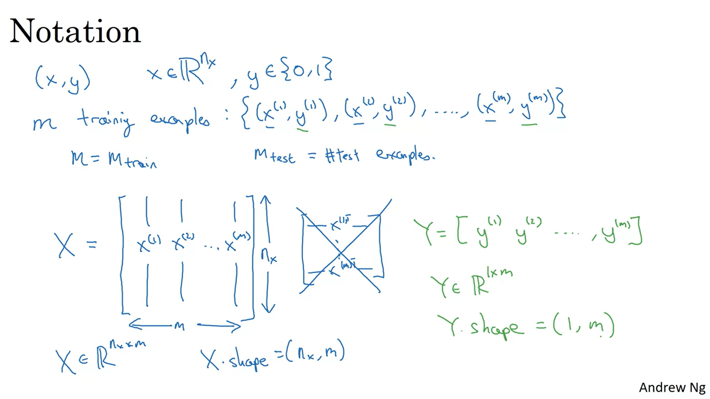

The Sigmoid function (as given below) is applied to the output (Z) in case of binary classifictaion

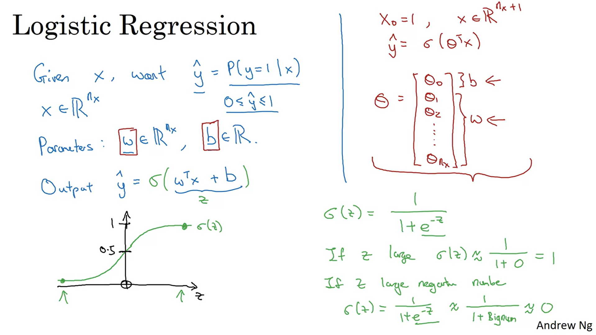

**Loss Function**  
Calculates how close is the predicted output to the original output.  
Loss function is defined for a single example
**Cost Function**  
It is generally the average of loss function over many examples. The models aim is to minimize this cost function

**Loss function used for Binary classificatiion**  

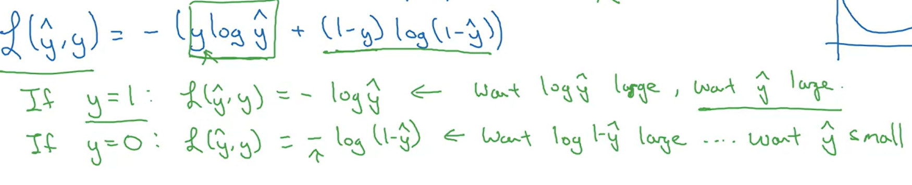

**Cost function for Binary Classification**  

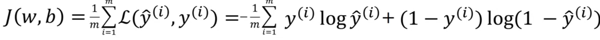

**Gradient Descent**  

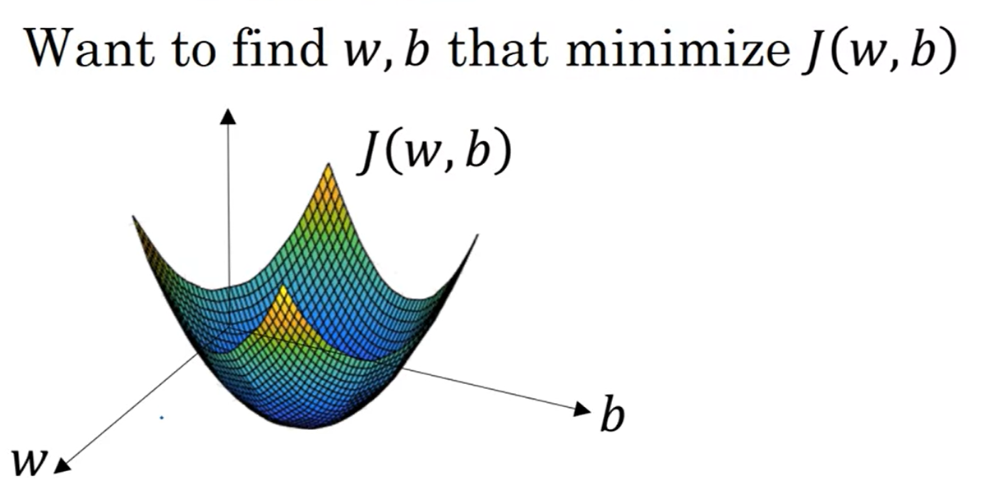

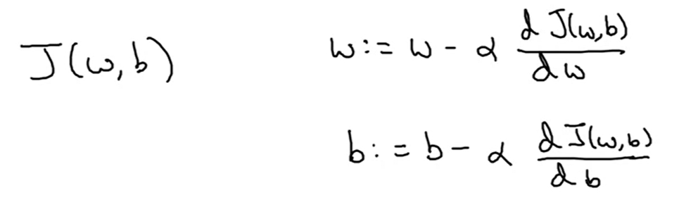

**Computation Graph**  
Computation Graph organises the steps in which you compute any given function. For example
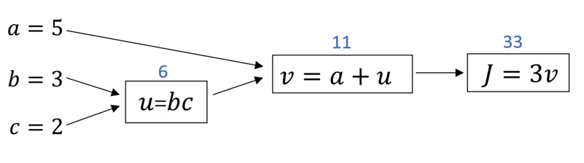
Its helps us calculate a derivatives in a simple manner by backpropogating from final output variable towards the input variables (right to left here)

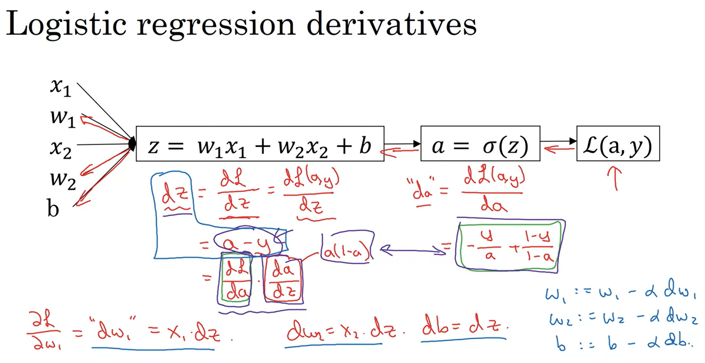

The following slide represent one step of gradient descent in great detail  
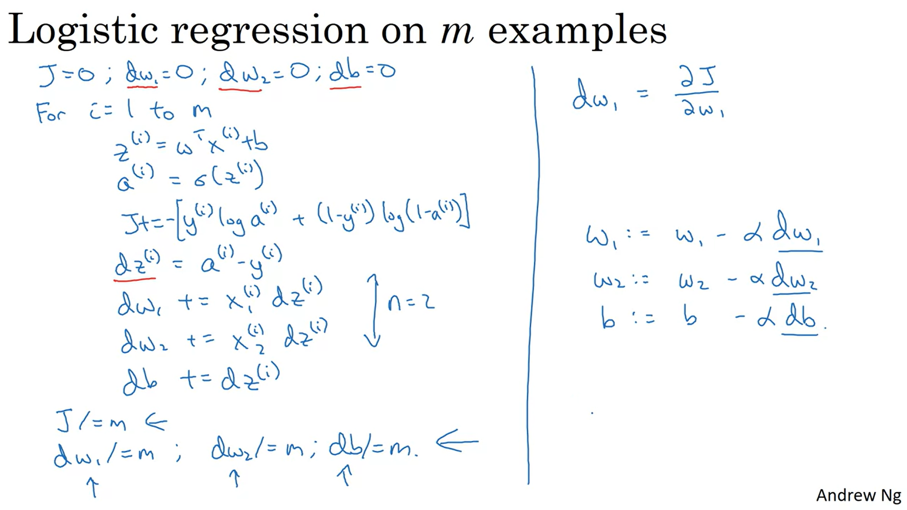

Multiple for loops in the code makes it inefficient to work with large data. This results in a need for Vectorization.  

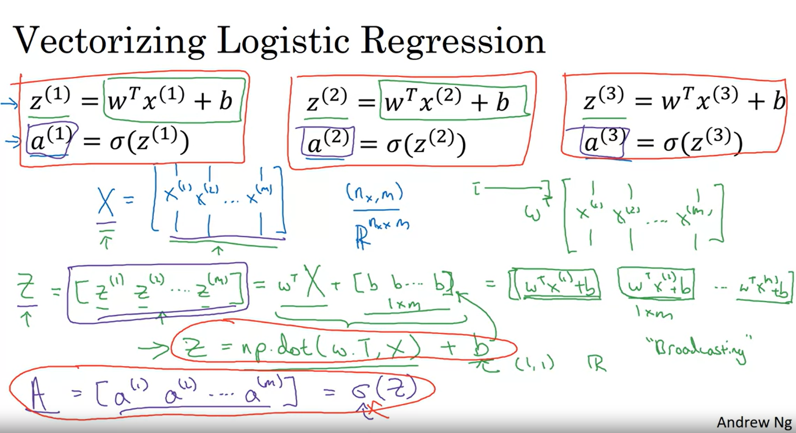  

Here is a one step of gradient descent in completely Vectorized form (without any for loops) shown in a great detail  
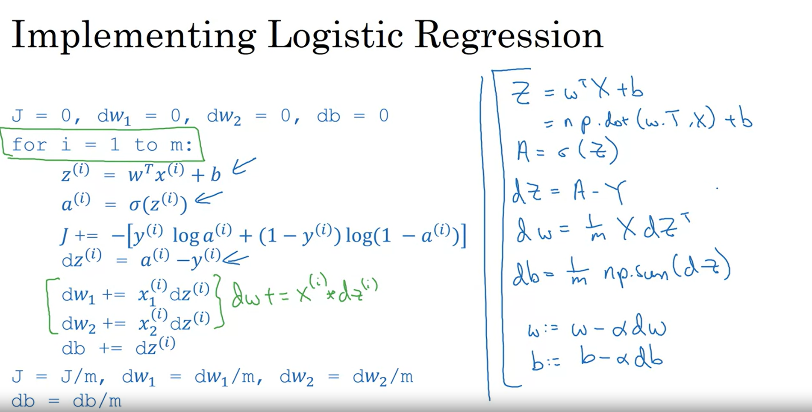  

**Python/Numpy tip**  
Don't use rank 1 arrays like these  

    #AVOID
    a = np.random.randn(5)  # This is a rank 1 array
    a.shape()       # Output is (5,)

Always specify complete dimensions

    a = np.random.randn(5,1)  # This is a rank 1 array
    a.shape()       # Output is (5,1)

Use asserts to make sure the shape is as expected

    assert(s.shape() == (5,1))
