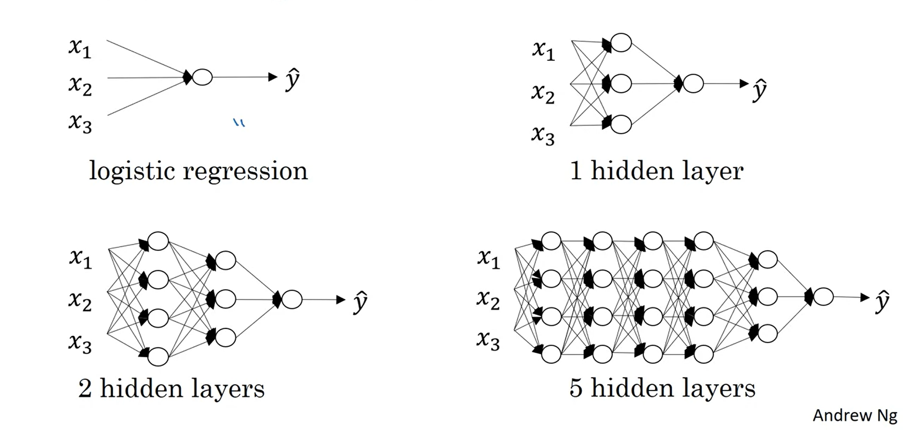
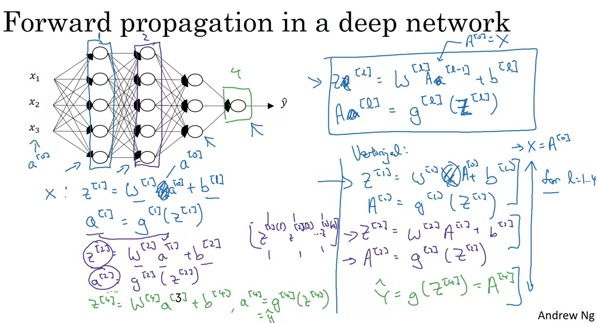
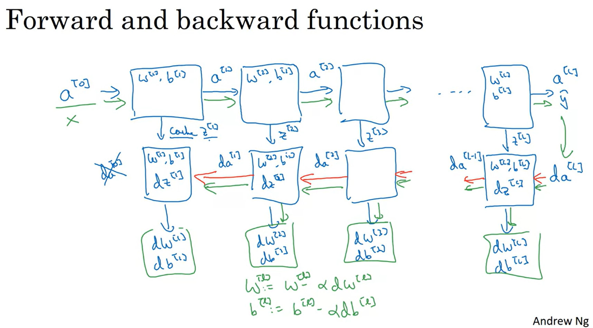
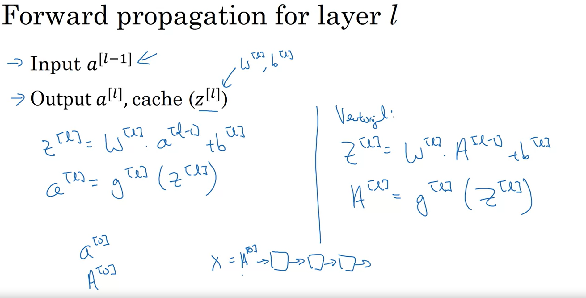
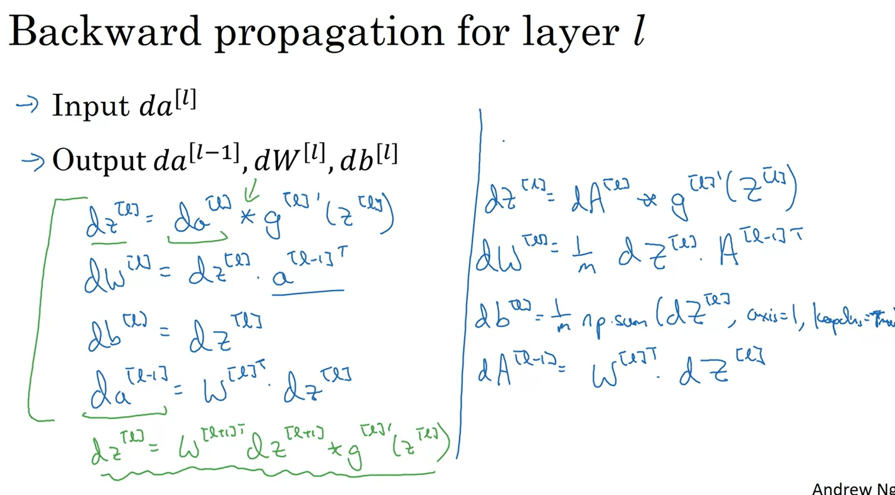

# Notes for week 4 of Course 1

## Deep Neuaral Networks

By now we have seen a Neural network with one hidden layer. A Deep Neural Network has multiple hidden layers

Given below are the equations for forward propogation in Deep Neural Network

Given below is a representation of one iteration in Deep Neural Networks  

