# Notes for week 1 of Course 2

There are many hyperparameters that we need to set during training of a model. Its not possible to guess these hyperparameters on the first go  
Hence machine learning becomes an iterative process, in which we experiment with different hyperparameters and pick the best ones

**Dataset**
The dataset is divided in following manner  

* **Training set** : Used for training
* **Validation set** (Dev set) : Used for evaluation of the current model. And select the best performing model
* **Test set** : For evaluation of the final model

Traditionaly the data is split into

* 70 / 30 into train and test
Or

* 60 / 20 / 20 into train, validation and test

But in the modern era, when we have huge amounts of data, we pick comparatively very less percentage of data for validation and test

For example, if we have 1,000,000 examples, then you could pick 10000 for test and validation each, that is around 1% for test and validation each  

We should make sure that the train/test set both come from same distribution. For example the train set uses images scrapped from a website, then the test set should also use images scrapped from that website

**Bias and Varience**
High Bias leads to underfitting  
High Varience leads to overfitting  
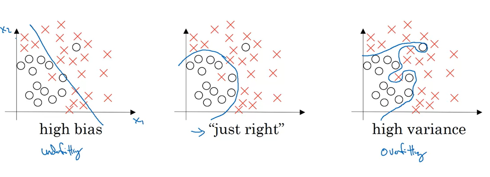

When the  dev set error is significantly larger than the training set, The model is said to be **overfitting** (It has **high varience**)

When the both the training set error and dev set error are poor, the model is said to be **underfitting** (It has **high bias**)
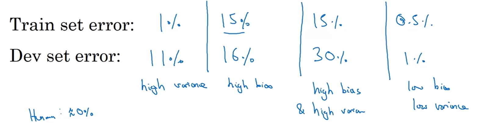

IF model has high bias, then try :

* Bigger Network
* Train longer
* Search for different NN architecture

IF model has high varience, then try :

* More Data
* Regularization
* Search for different NN architecture

## Regularizing Your Neural Network

**L2 Regularization**
While training the model, the aim is to reduce the cost function  
For regularization, we add a term containing W in the cost function. This way our algorithm also makes sure that any Weight parameter doesn't shoot high (which will lead to overfitting)

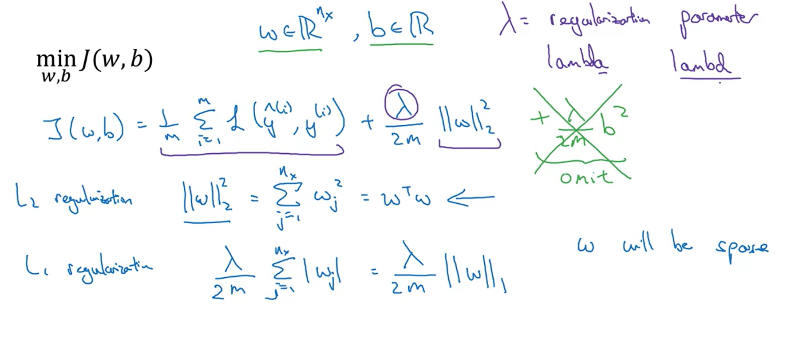

The lambda is a hyperparameter which controls the weightage of that extra term in cost function. We have to experiment with different values to get best results.

**Note** : **lambda** is a reserved keyword in python, so we could use "lambd" instead

The Frobenius norm (used in L2 regularization) is given as
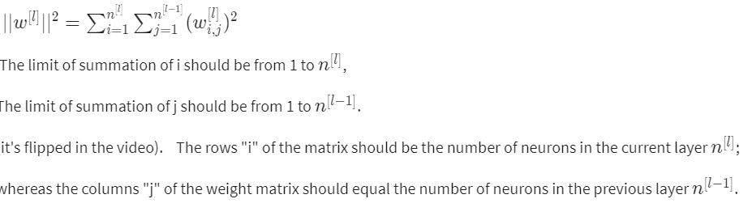
After adding the extra term in cost function the derivatives change as follows
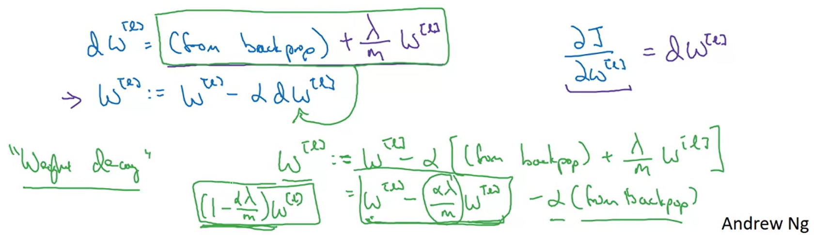
L2 regulariztion is also called **weight decay**

**Dropout Regulariztion**
In every iteration, from each hidden layer a given percentage of randomly choosen nodes are dropped and hence zeroing out there effect
A simple implementatioon in python can be
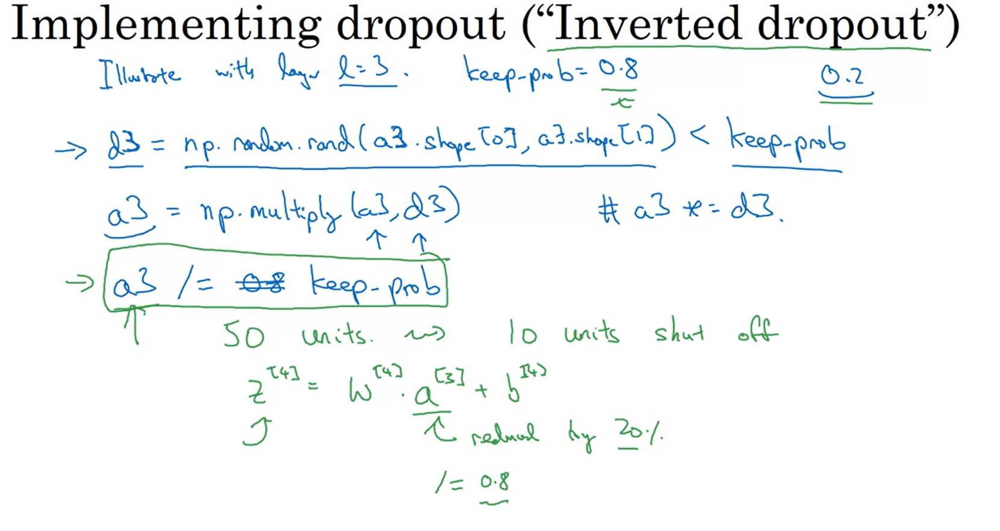
**Note** : We should not implement dropout while testing or predicting

Dropout makes sure that the out doesn't rely heavily on any single feature. Hence the weights are spread out.

**Other Regulariztion techniques**
**Data Augmentation** : You generate extra training examples from the existing examples by doing trivial operations ( like flipping and/or cropping an image )

**Early Stopping**
You stop the training just before the dev set error starts to increase again (due to overfitting)

## Optimizing training process

**Normalizing the input**
Normalizing is performed in following steps

* Subtract mean from every value. Now the mean becomes zero
* Normalize the variance and hence make the varience 1

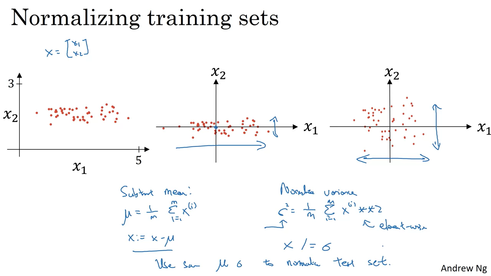

The above steps also need to be performed on the test data. You should avoid normalizing train and test data seperately. The mean and varience can be stored so that it can be used in future to normalize input during predictions.
It makes sure that all the features are in similar scale
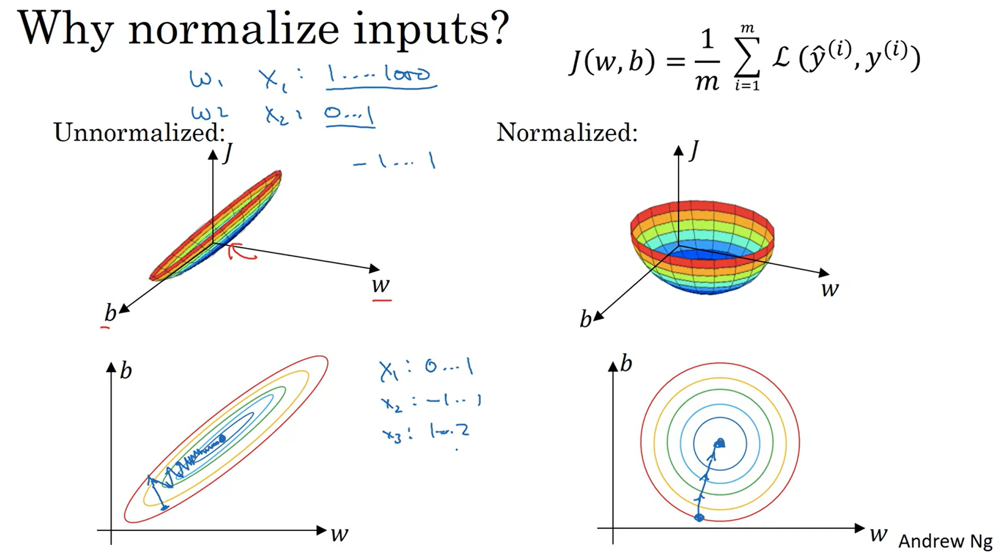

**Vanishing / Exploding Gradients**
When you have a Neural network with large number of hidden layers, then the gradients/activations tend to increase / decrease exponentially as you propagate forward / backword

* When the all values in the weight matrices are less than 1, it will cause the activations to vanish exponentially as you propogate forward, and also the gradients to vanish exponentially as you propogate backwards

* Similarly, when there are values in the weight matrices which are greater than 1, it will cause the activations to explode exponentially as you propogate forward, and also the gradients to explode exponentially as you propogate backwards
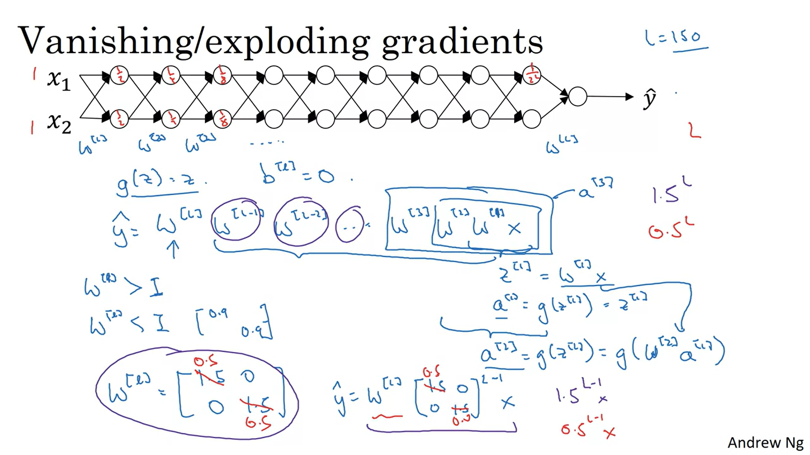

**Weight Initialization**
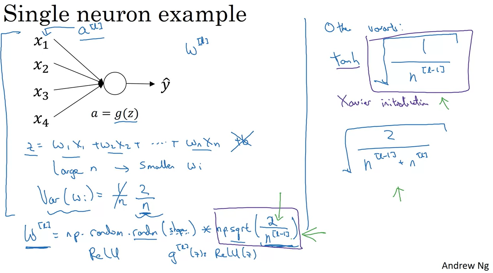

**Doing gradient Checking**
This makes sure that your algoritm and implementation is correct. We could use following formula to get approximate gradient for f(tita)
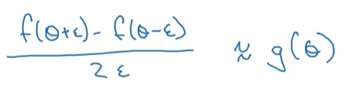

STEPS :

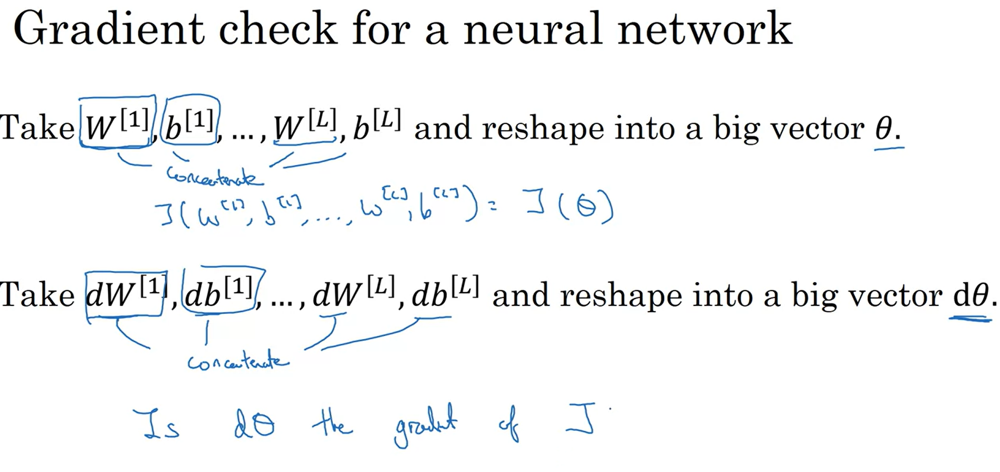
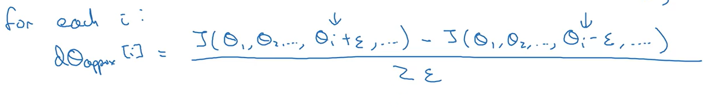
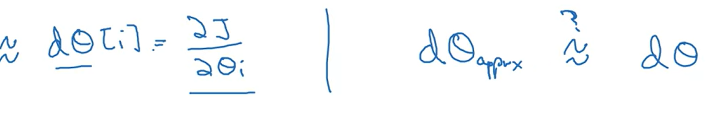
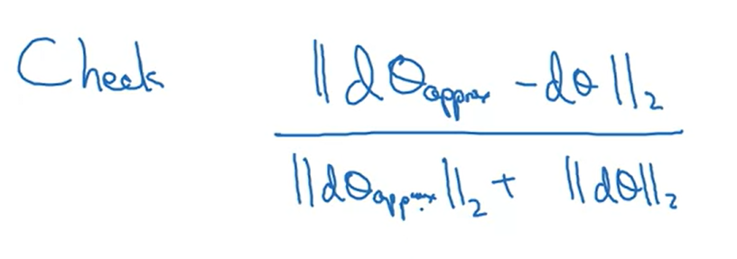
The above expression checks whether two vectors are close to each other. The value of expression should be less than equal to epsillon (a very small value like 10^7)

Notes for implementating Gradient checking

* Don't use in training. Only use to debug
* If grad check fails, then look at components and try to identify the bug
* It doesn't work with dropout
