# Notes for week 2 of Course 2

## Optimization algorithms

**Mini Batch Gradient Descent**
Vectorization allows us to efficiently compute on all of the examples at the same time
If the amount of data is very large, then one iteration can take considerably long time. And hence even one step of gradient descent takes a long time
To Takle this issue we split the training data into small batches (hence called mini-batch) and do gradient descent for one batch at a time. This speeds up the gradient descent algorithm

For example, suppose we have 5,000,000 examples for training, we could split those examples into mini-batches of 5000 each
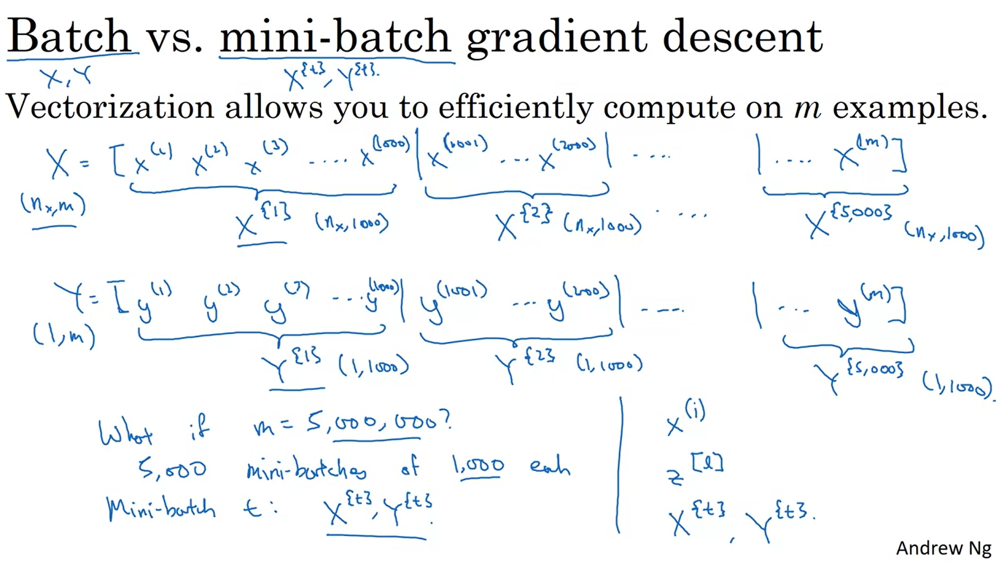

1 epoch means 1 pass through the entire training set
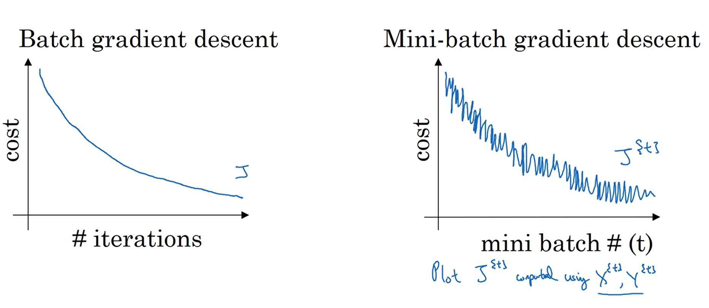
The graph is noisy in mini-batch because after every step you have a different set of examples (whereas you calculate gradients with respects to current set)

The size of a mini-batch is a hyperparameter

* When size equals 'm', its called "batch gradient descent", since you are using entire batch at the same time
* When size equals '1', its called stochastic gradient descent
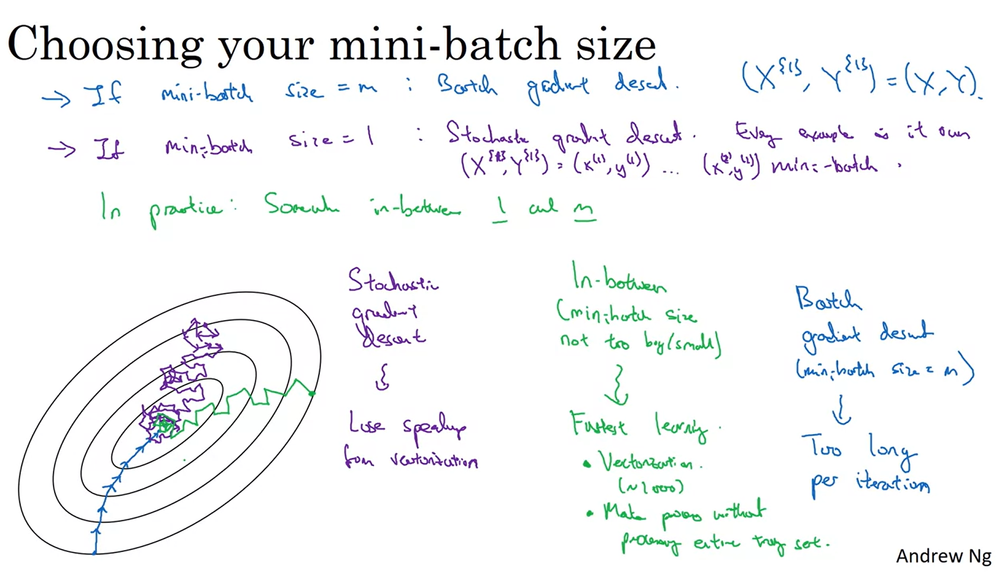
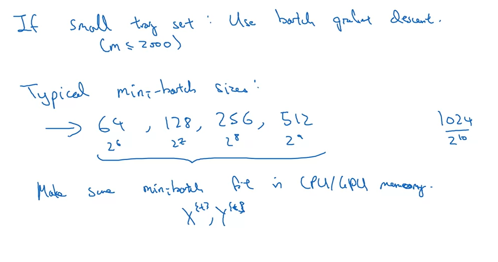
Batch size that is power of 2 is preferred, since it helps CPU/GPU perform operations smoother

**Exponentially weighted average**
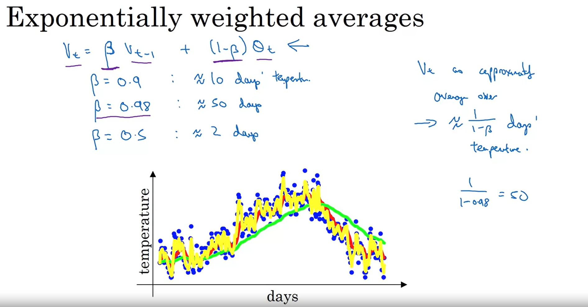
Getting intuition for Exponentially weighted averages
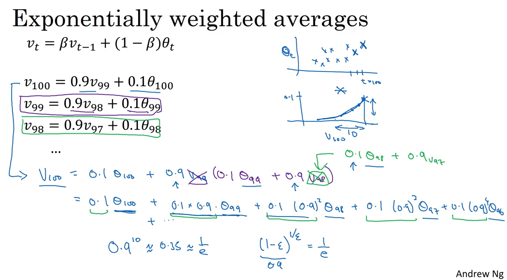

**Bias correction**
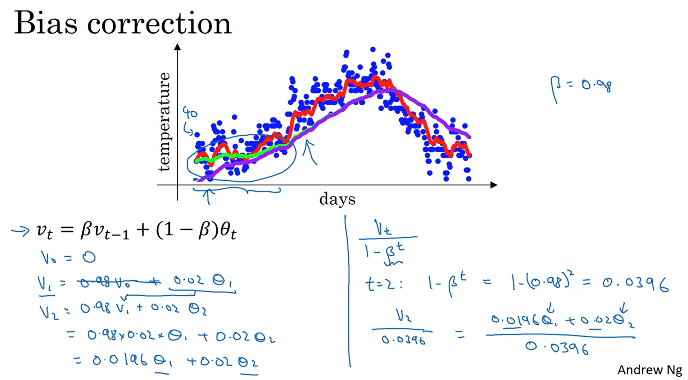

**Gradient Descent with momentumn**
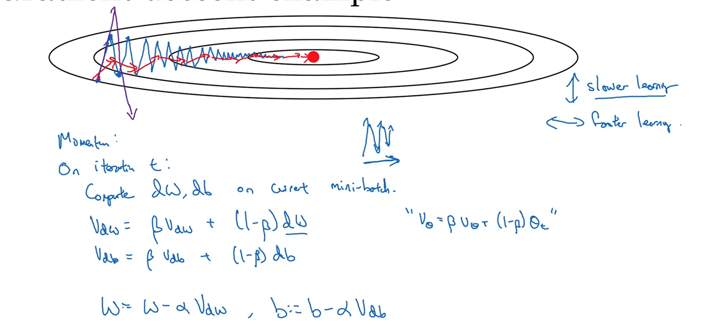
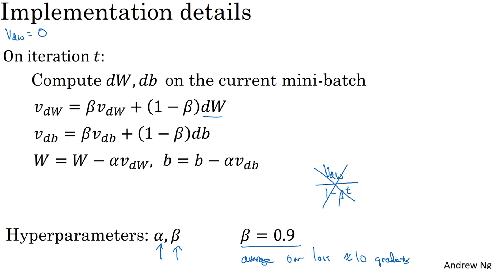

**RMS Prop**
Root mean square prop
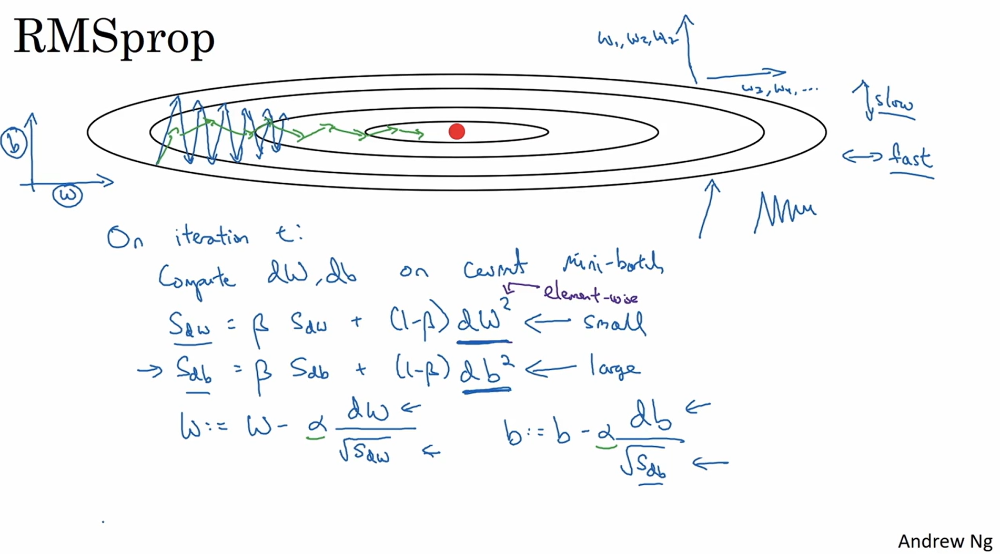

**ADAM optimizer** (Adaptive Moment Estimation)
This algorithm combines the capabilities of Gradient Descent with momentum as well as RMS prop
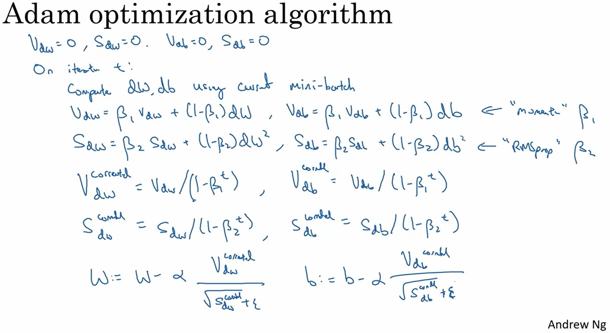
Recommended hyparameters
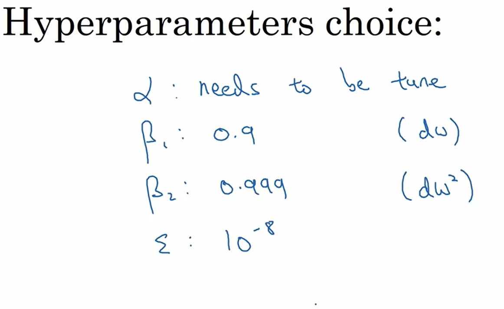

**Learning rate decay**
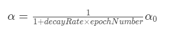
It avoids overshooting the minima. Hence helps us get more closer to the minima
Other methods for learning rate decay are
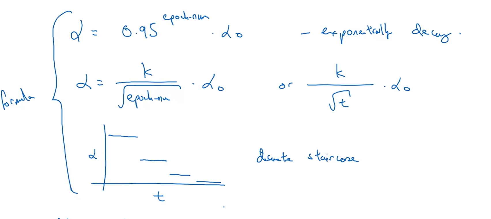

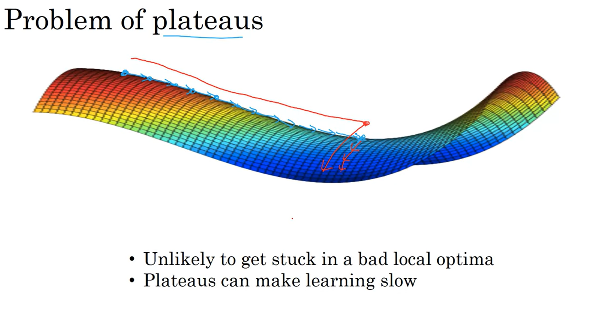
Plateaus slow down learning, since the gradients are really small.
The optimizing algorithms that we discussed helps us to overcome these bottlenecks
