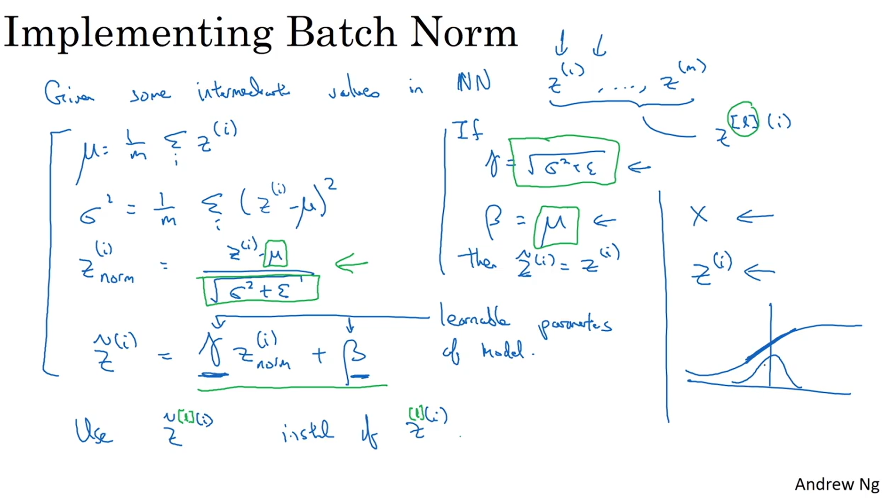

# Notes for week 3 of Course 2

## Hyperparameter tuning

Here are some important hyperparameters

* Learning rate generally is the most important one
* Then 2nd priority is given to those boxed in yellow
* 3rd priority is given to those in purple

(left is grid and right has random points)

It basically implies to zoom in to the region where we are getting better results

**Using appropriate scale to pick random hyperparameters**
First evaluate the range of the target hyperparameter
If the range is too high or too small, then take random values on log scale, otherwise taking random values on linear scale works

There are two typical approaches for tuning hyperparameters

* You have enough computational resources to train the model in parellel for finding the best hyperparameters. This one is shown in the right

* You don't have enough computational resources, hence you keep developing the same model day by day. Keep experimenting with hyperparameters on the same model. This one is shown in the left

**Batch Normalization**
Previously we discussed normalization of input X
Similarly applying normalization between the hidden layers would also improve the model
Mostly the normalization is applied on Z instead of activations.
While we apply normalization we basically tranform our data to have a mean of 0 and variance of 1. But we could actually let the model learn what should be the best mean and variance in the normalization layer. This adds two learnable parameters

**Softmax Regression**
It used used in classification problems. In output layer, instead of sigmoid activateion, the softmax activation is used

**Deep learning Frameworks**

