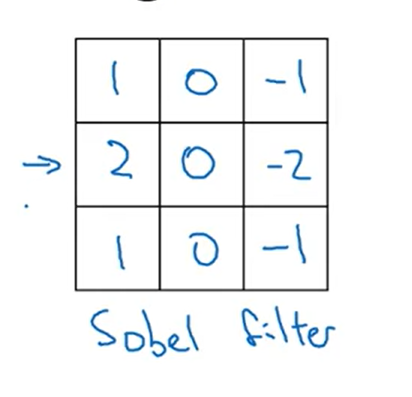

# Notes for week 1 of Course 4

## Convolutional Neural Networks

Computer Vision Problems

* Image classification
* Object detection
* Neural Style transfer (Input an original image andget it repainted in different style)

Images can become very large (in size)
Previously we trained neural network on a 28 by 28 images with 3 channels (RGB) summing up to 12288 input features
As we increase the size further it becomes unmanagable to train the neural network with so many input features
For example consider a 1000 by 1000 px image with 3 channels. The number of input features will be 3,000,000 !!!

To takle this problem we need to use Convolution operations

Example of Convolution operation


Example of Edge detection


**Sobel filter**

Gives a little bit more weight in the middle thus making it robust

**Schar filter**


Instead of handpicking these filters, we could have the model to learn the filter for itself.

This way we can treat these filters as the parameters to be learnt

**Padding**
If you have an **(n\*n)** image and **(f\*f)** filter then the output will be **(n-f+1) \* (n-f+1)**
f is usually odd

The pixel in the corner of the image is used by only one Convolution operation. We might be losing information here
So to preserve the dimensions of the input, you can add padding to the image. You generally apply a padding of **(f-1) / 2**

Types of Padding

* **Valid** : No padding is applied
* **Same**  : Padding is applied such that the output has same dimensions as the input

**Strided Convolution**
Instead of moving the filter by 1 unit after each opertion. It is moved the value specified by stride


Convolutions over Volume


The number of channels in the input and the filter should be same. These results in the output to be single channeled.
But if you use multiple such filters simultaneously, then we get multiple single channeled outputs. Now these outputs could be stacked on top of each other resulting in a single output in which the number of channels is equal to the number of filters used

**Single Convolution Layer**


* The filters are the **weights** (W)
* We add **bias** (b) to the output image to get the final output (Z)
* We apply **activation** like **RELU** to the final output **(Z)** to get the **(A)** which could be the input for the next layer
* The input image can be called **A_prev**

**Note** : The number of **channels in the output** is equal to the **number of filters** used in that layer


Complete CNN


Types of layers in CNN

* Convolution layer : (CONV)
* Pooling layer : (POOL)
* Fully Connected Layer : (FC)

**Pooling layers**

There are no parameters to learn in Pooling layer
Pooling operation is done independently on each channel

Types of Pooling

* Max Pooling : Maximum value of the region is extracted
* Average Pooling : Average value of the region is extracted

Dimensions of input and output


**WHY CONVOLUTIONS**

**Sparsity of Connections**
In each layer output value depends only on a small number of inputs

## Backpropagation in Convolutional Neural Networks

In modern deep learning frameworks, you only have to implement the forward pass, and the framework takes care of the backward pass, so most deep learning engineers don't need to bother with the details of the backward pass. The backward pass for convolutional networks is complicated. If you wish, you can work through this optional portion of the notebook to get a sense of what backprop in a convolutional network looks like.

When in an earlier course you implemented a simple (fully connected) neural network, you used backpropagation to compute the derivatives with respect to the cost to update the parameters. Similarly, in convolutional neural networks you can calculate the derivatives with respect to the cost in order to update the parameters. The backprop equations are not trivial and were not derived in lecture, but  are briefly presented below.

### 1 - Convolutional Layer Backward Pass

Let's start by implementing the backward pass for a CONV layer.

#### 1.1 - Computing dA

This is the formula for computing $dA$ with respect to the cost for a certain filter $W_c$ and a given training example:

$$dA \mathrel{+}= \sum _{h=0} ^{n_H} \sum_{w=0} ^{n_W} W_c \times dZ_{hw} \tag{1}$$

Where $W_c$ is a filter and $dZ_{hw}$ is a scalar corresponding to the gradient of the cost with respect to the output of the conv layer Z at the hth row and wth column (corresponding to the dot product taken at the ith stride left and jth stride down). Note that at each time, you multiply the same filter $W_c$ by a different dZ when updating dA. We do so mainly because when computing the forward propagation, each filter is dotted and summed by a different a_slice. Therefore when computing the backprop for dA, you are just adding the gradients of all the a_slices.

In code, inside the appropriate for-loops, this formula translates into:

```python
da_prev_pad[vert_start:vert_end, horiz_start:horiz_end, :] += W[:,:,:,c] * dZ[i, h, w, c]
```

#### 1.2 - Computing dW

This is the formula for computing $dW_c$ ($dW_c$ is the derivative of one filter) with respect to the loss:

$$dW_c  \mathrel{+}= \sum _{h=0} ^{n_H} \sum_{w=0} ^ {n_W} a_{slice} \times dZ_{hw}  \tag{2}$$

Where $a_{slice}$ corresponds to the slice which was used to generate the activation $Z_{ij}$. Hence, this ends up giving us the gradient for $W$ with respect to that slice. Since it is the same $W$, we will just add up all such gradients to get $dW$.

In code, inside the appropriate for-loops, this formula translates into:

```python
dW[:,:,:,c] += a_slice * dZ[i, h, w, c]
```

#### 1.3 - Computing db

This is the formula for computing $db$ with respect to the cost for a certain filter $W_c$:

$$db = \sum_h \sum_w dZ_{hw} \tag{3}$$

As you have previously seen in basic neural networks, db is computed by summing $dZ$. In this case, you are just summing over all the gradients of the conv output (Z) with respect to the cost.

In code, inside the appropriate for-loops, this formula translates into:

```python
db[:,:,:,c] += dZ[i, h, w, c]
```
