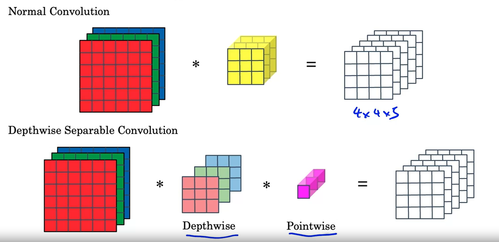

# Notes for week 1 of Course 4

## Case studies

Few clasic Networks

* LeNet-5
* AlexNet
* VGG
* **ResNet**
* **Inception**

**LeNet-5**

* It was developed to classify handwritten digits
* It had 60 thousand parameters, which significatnly smaller compared to modern networks
* Didn't use RelU activation, instead used sigmoid and tanh
* Did not use Max pooling instead used Average Pooling
* Did not used softmax classifier, used some different classifier

* **AlexNet**

* It was developed for classeify 1000 classes of objects
* It has 6 million parameters
* Since at the time of release, the Computational power wasn't very promising, it used multiple GPUs to train.

* **AlexNet**

* Simple architecture
* Always used Convolution layers of 3 by 3 filters with same padding
* Always used Max Pooling layers of 2 by 2 with stride of 2
* It had total of 16 layers which had learnable weights
* Has 135 Million parameters
* It uniformity made it a attractive model
* The general observation was the dimensions went on decreasing and the number of channels went on increasing

## ResNets

Deep Neural Networks are difficult to train because it results in Vanishing / Exploding gradients
This is where skip connections come into play. Basically you take the output of a layer and feed in as input to more deeper layer into the network
This helps us build a very deeper networks.

Below is an example of Normal Network

Below is an Example of skip connection

* The A[l] is injected just before the ReLU part
* This allows us to train much deeper Neural Network
* The 2 layers in the skip connections need to have same dimensions. Hence "same" padding is used mostly.
* If the dimenions are not same then an extra weight matrix is added.
For example here, since A[l] has 128 units and A[l+2] has 256 units, we add a weight matrix of (256 by 128) so that when we take matrix product of (W x A[l]) we get 256 by 1 output

**Residual Block**

**1 by 1 Convolution**

Its useful when you have to only change the number of channels in any layer.
For example the above image has a layer with 32 channels. We could use 16 filters of 1 by 1 to convert the number of channels to 16

## Inception Network (GoogleNet)

* Instead of picking one of (1,1) / (3,3) / (5,5) or some other convolution, in inception network we can pick multiple of those at the same time what whatever the outputs are, stack them on top of each other (for this "same" padding has to be applied)

Note in the above image for Pooling to work we need have stride of 1 and have same padding

The above Convolution requires a whopping 120 million multiplication
This is where 1 by 1 Convolutions can help us

This reduced the computional cost by a tenth upto 12 million multiplications

These were the building blocks of the Inception Network

Below is a representation of one inception module

An inception Network is made by putting together a lot of such modules together and is shown below

One detail that is missing in the above image is that there also exist a side branches.

These side branches ensure that the features learnt till that particular hidden layer are also good enough to make prediction

## MobileNet

* Allows to build and run Neural Networks that would also work in low compute environment like mobile phone
* Useful for Mobile and embedded applications
* Key idea is that they have **dephtwise seperable convolutions** instead of normal convolution

Note the computational cost

In here, one filter of size just 3 by 3  is used only on one channel for example Red. Thats the reason its called Depthwise Convolution. This way we need just 3 filters of size of just 3 by 3 to get the output.
Note that the output and input ends up having same number of dimensions.
Hence to get the desired number of outputs, pointwise convolution is applied, which carry out 1 by 1 convolutions to get the desired number of channels

These were the building blocks for MobileNet

Have a look at MobileNet V1 and V2 architectures.

These have a significantly low computation costs
V2 architecture is different from V1 in following ways

* The single block is repeated 17 times in V2 where as 13 times in V1
* V2 contains Residual Connections
* V2 has one extra operation in each block called "Expansion" operation.

The advantage of the bottleneck block is that it required less memory while passing the activations to the next block and hence is more efficent memorywise

## EfficientNet

* So MobileNets are computationally less expensive but come with a bit of sacrifice in a performance
* So if we are in a Computationally limited environment then we need our Model to be less computationally expensive at the expense of accuracy, otherwise we could allow it to be computationally expensive and give us a better accuracy.
* EfficientNet allows a model to automatically perform according to the environment

So there are basically 3 things to you can do to get better performance with any model as stated above

* Use high resolution input
* Use deeper Network
* Increase the width of layers. (No. of units or dimensions)

So one of these things is picked depending on the enironment

## Transfer Learning

Transfer learning refers to using the parameters of a model which has already been trained on some data. These parameters are used as a good initialization point for our model.
Instead of initialization we could also freeze some parameters (assuming they are well learnt features) and use the rest of the model

## Data Augmentation

Creating more data (by subtle variations of existing data) from the existing data.

**State of Computer Vision**

