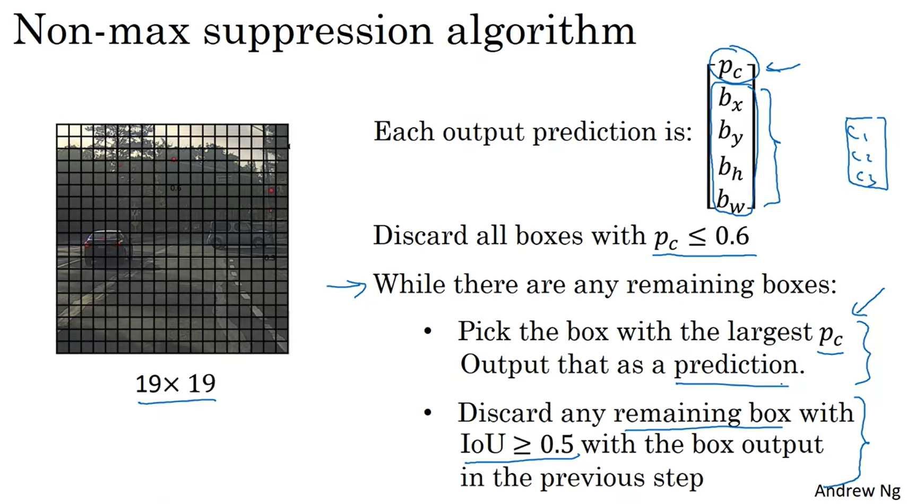
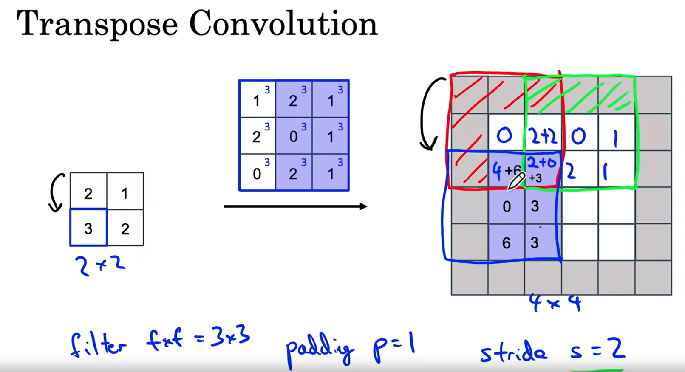

# Notes for week 3 of Course 4

## Object Detection

**Object localization** refers to determining the position of the obejct in the image
In Object classification and Object recognition there is only one object in the image.

**Object Detetction**
In this task you may have multiple objects in the image, also of multiple classes. Also you have to determine the position of the object in the image

In object localization, we need to find the binding box for that object. This basically means to find coordinates bx, by and dimensions bh and bw which make up the bounding box

In this image,

* Pc refers to whether there is an object or not (1 or 0)
* bx, by, bh, bw specify the bounding box
* c1,c2,c3 refers to the probability of classes (1,2,3)

**Landmark detection**
Instead of determining binding box of the object, it detects the landmarks in the image/object.
For example if there is a person's face, then you can have landmark detection to detect the points where the eyes are located, mouth, face edge, etc.

**Object Detection**
You could detect multiple objects in the image using sliding window detection. You basically keep the window over every region in the image and do object classification + localization in that window
Computational cost is a disadvantage here. This takes a lot of time
Hence sliding windows need to be implemented efficiently

We see that a lot of computation is repeated we use sliding windows in normal way. So we do forward pass on the entire image till we get a smaller grid. And now this grid represents different crops from the original image. So this saves us a lot of computation.

**YOLO Algorithm for finding bounding box**

**Evaluation of bounding box**
**Intersection over Union** is used to evaluate the predicted bounding box

**Non-max Suppression**
So when you are running an algorithm, you might detect the same objects multiple times in different cells
Non max suppression cleans these multiple detection

**Anchor boxes**
Previously (before using anchor boxes):
Each object in training image is assigned to grid cell that contains its midpoint.

But if there are multiple objects of different classes in the same grid cell, we have a problem. For this reason achor boxes are used
Each object is assigned to a pair (gridcell, anchor box with highes IoU)

Achor box have shape similar to the expected shape for that particular class

**Training using YOLO**
IF you use a 3 by 3 grid and 3 anchor boxes then the output would be (3 by 3 by 2 by 8). The last 8 is broken down into (1 for whether there is any object + 3 classes + 4 for bounding box)

**Semantic Segmentation with Unet**
In this case, instead of determining the bounding boxes, each of the pixels in the image is label.
For example in a self driving car, each pixel in the image is labelled as wheter its a drivable road or not.
Unet algorithm is used for this

**Transpose Convolution**

In here, instead of placing the filter on the input, the filter is placed on the output

Given below is a brief high level representation of Unet

Given below is the detailed version

Its called Unet because it looks a bit like U.
