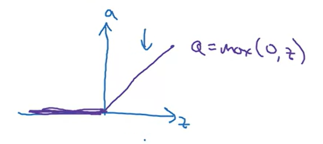
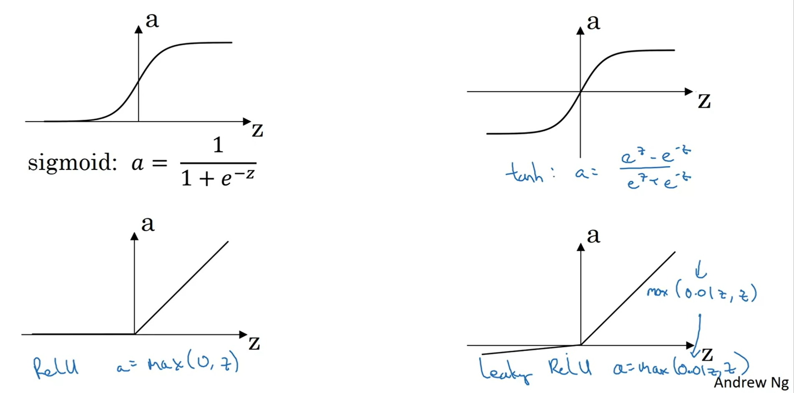
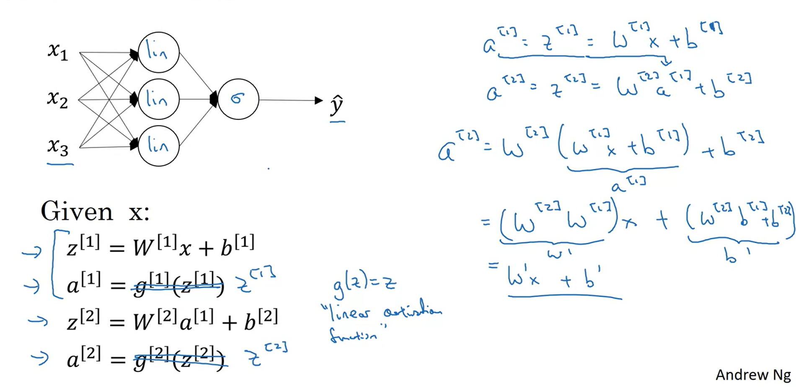
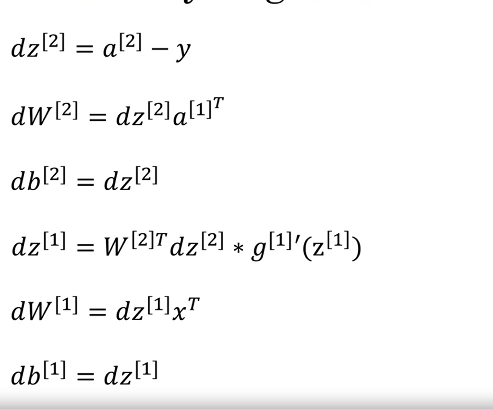

# Notes for week 3 of Course 1

## Shallow Neuaral Networks

Overview of Neural Networks

When the superscript is in square brackets, it represents the number of hidden layer. And when its in curve brackets, it represents the number of training sample  

Vectorization of multiple training examples

**Activation function**
In hidden layers tanh function is always preferred over sigmoid function. This is because the ouptut of a sigmoid function ranges between 0 to 1, hence mean is close to 0.5  
Whereas the output of tanh ranges from -1 to 1 and the mean is close to 0  
Hence tanh almost always gives better results  

The graph of tanh function is similar to sigmoid function with just the centre shifted to origin

But **the downside** of tanh or sigmoid is that when the input is large in magnitude, the slope becomes close to 0. This affects the gradient descent algorithm. And hence learning slows down  

The RELU activation function solves this problem
**RELU** : Rectified Linear Unit  

The derivative of RELU is 0 when input is less than 0, otherwise 1  
A variation of RELU is Leaky RELU. Its derivative is a very small value when input is less than 0, otherwise 1  

**Summary of Activtaion functions**  

**What happens if we use Linear Activation function**  
If we use linear activation function, then the final output just ends up becoming a linear function of the input. So it eventually behaves as if we have only one layer no matter how many layers actually exist.  
  

**Backpropogation with gradient Descent**  
  

**Initializing Paramaters**
We should make sure to not initialize the Weight parameters to zero, because if we do that then it results in all hidden units to be symmetric (basically they all compute the same functions) no matter the number of iterations you do  
Hence the Weight parameteres should be initialized randomly

