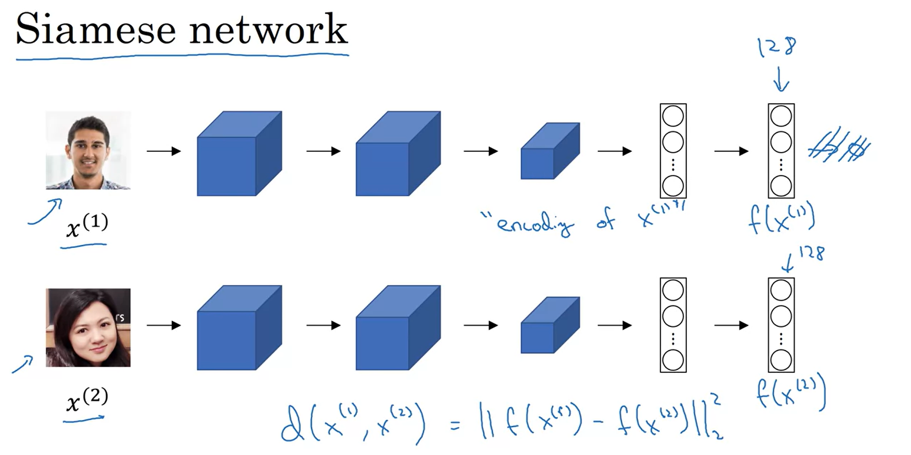
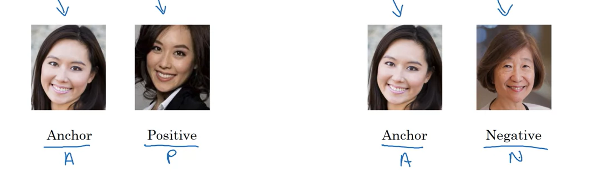
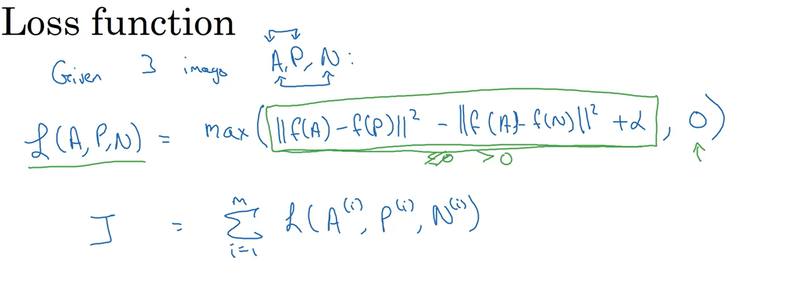
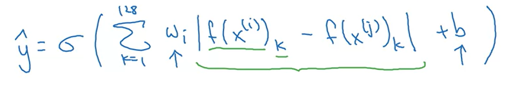
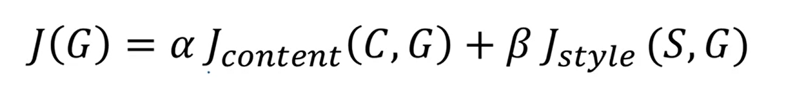
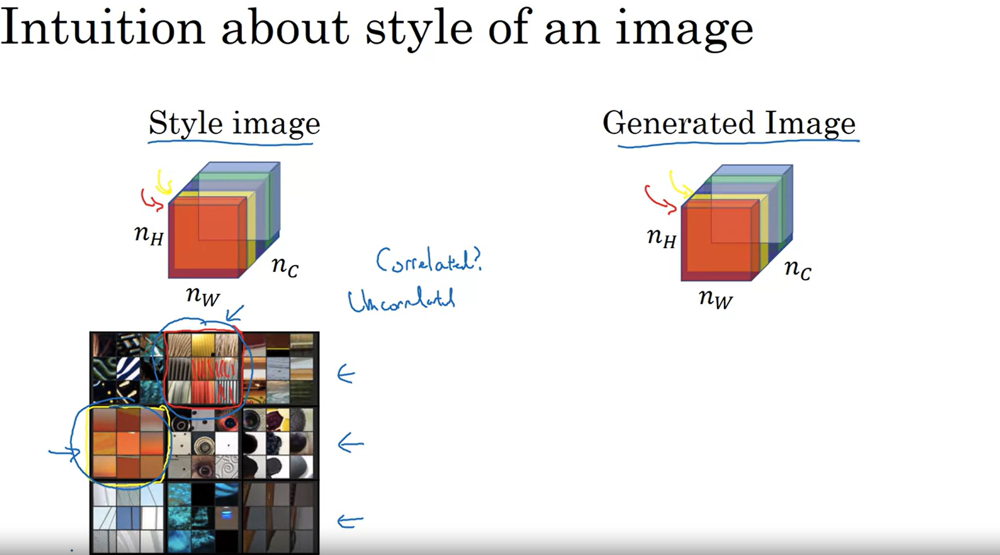

# Notes for week 4 of Course 4

## Face recognition and Neural Style transfer

There is a difference between face recognition and face verification.

**Face verification**
Given the input image,name and id verify whether the input image belongs to the claimed person. Its a 1 to 1 problem

**Face recognition**
It has a db of K people. Givem an input image, outputs the if its any of the K people otherwise "not recognised". This is 1 is to k problem

**Once shot learning**
The neural has to learn the face given only 1 image of that person.
So we can't approach this as a classification problem.
Instead we use "similarity" function.
This function inputs two different images and determines how different are the faces in those 2 images.

**Siamese Network**

In the final layer it generates the encoding for the innput image.
We generate encodings (128 dimensional) for 2 different images using this same network and then compare these to encodings to determine whether this is same person or not

How is this Network trained?

**Triplet Loss**
You look at the 3 images at a time

Anchor image : Original
Positive image : Of the same person as the anchor image
Negative image : Of the different person that the anchor image
The difference between anchor and positive should be minimum and that between the anchor and negative should be maximmum.

Note that for training, you do require multiple images of the same person.
Choose the triplets which are hard to differentiate. This will help model to learn better.

**Training Network as Binary Classification Problem**

Two images are fed to the network. And the final layer contains a single neuron. The output is 1 if both images are of same person, otherwise 0.
Now instead of passing fx1 and fx2 differently, you can pass the difference |fx1 - fx2| to the final neuron and run activation.

**Neural Style Transfer**
Takes 1 content image and takes 1 style image. It generates the new content image with given style

About Deep Networks

* The shallower layers in the network are learning simple patterns like edges and other. They are activated by these simple patterns
* The deeper layers in the network learn complex patter. Maybe a face, a tire, a dog, etc.
The more deeper the layer is, the more complex patter it is learning.

Let C be content image, S be style image and G be generated image. Then cost function for generated image consist of two parts.
One is J of C,G which calculates how close is the generated image to C
Other J of S,G which calculates how close is generated image to S

Finding the generated image

If two channels are said to be correlated it implies they have similary styles. Or appear together. The correlation between channels is calulated by looking at how similar are the activations.

Here Gs and Gg capture the style matrices S and G
Now the cost function can be defined as

Note the above cost function is for lth layer
The thing in the denominator is just a normalization constant.
Overall cost function is

